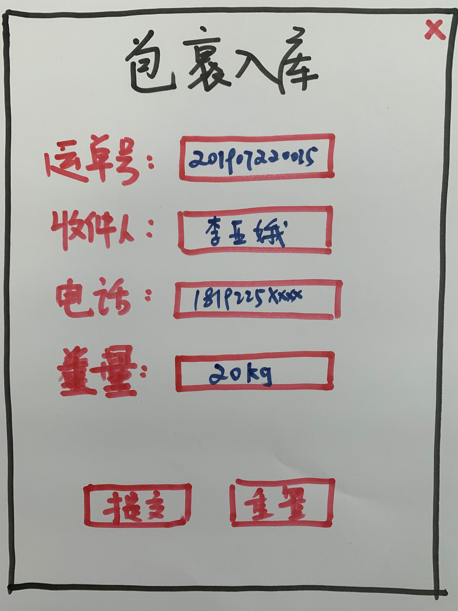
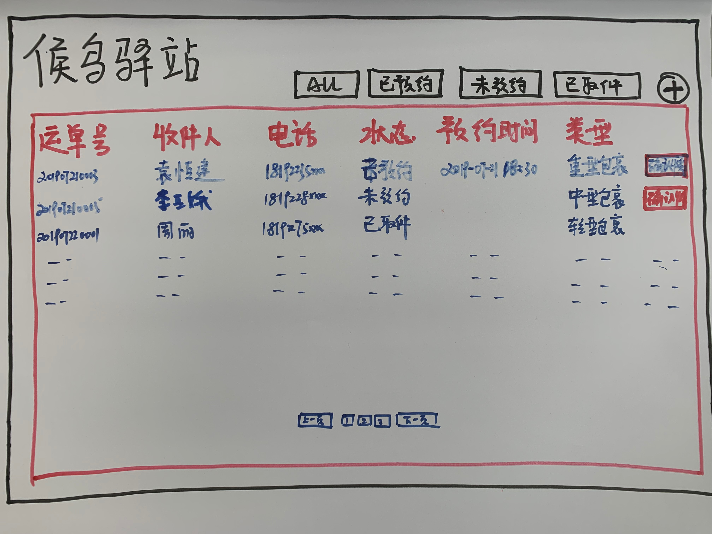
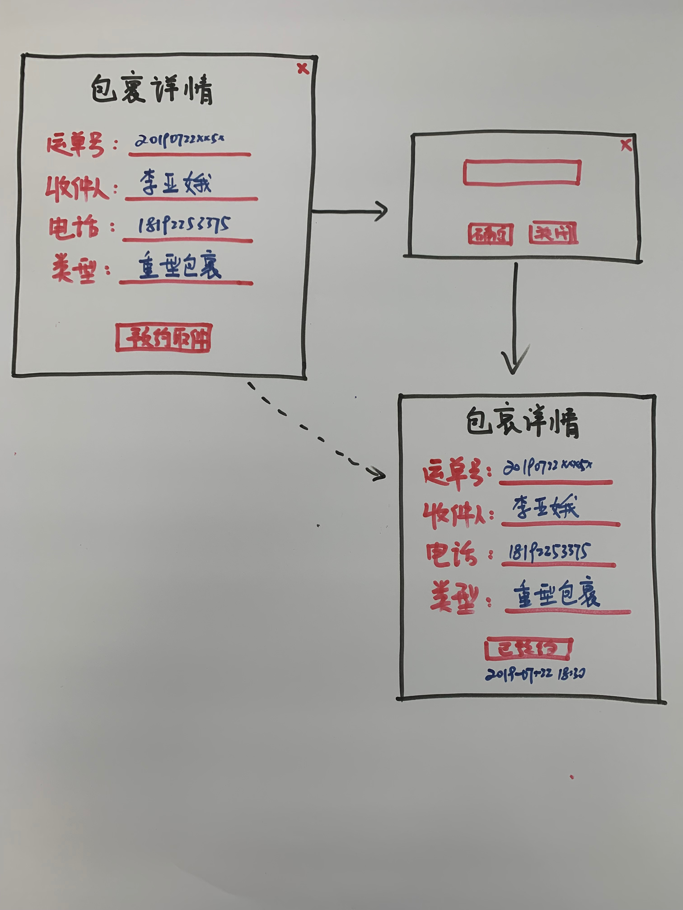

# package-booking-frontend

## Project setup
```
yarn install
```

### Compiles and hot-reloads for development
```
yarn run serve
```

### Compiles and minifies for production
```
yarn run build
```

### Run your tests
```
yarn run test
```

### Lints and fixes files
```
yarn run lint
```

# Mockup
## 包裹入库

## 欢迎页面

## 列表页面

## 包裹详情-预约取件



### Customize configuration
See [Configuration Reference](https://cli.vuejs.org/config/).
